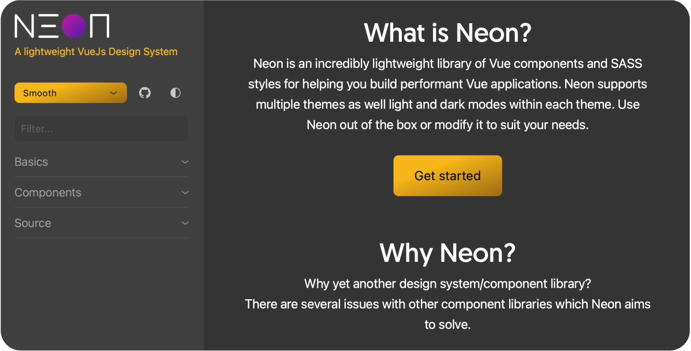

_A lightweight VueJS Design System_

_A lightweight VueJS Design System_

## Documentation & Demo
Full documentation is available on the [demo site](https://aotearoan.github.io/neon/).

## Installation
Install with NPM:
<pre>npm install @aotearoan/neon</pre>
or yarn:
<pre>yarn add @aotearoan/neon</pre>

## Usage

### Javascript/Typescript
Import components and supporting classes like so:
<pre>
import { Component, Vue } from 'vue-property-decorator';
import { NeonLogo } from '@aotearoan/neon';

@Component({
  components: {
    NeonLogo,
  },
})
export default class App extends Vue {}
</pre>

### SASS
First select a theme:
<ul>
  <li>smooth</li>
  <li>classic</li>
  <li>sharp</li>
</ul>

To use a theme without any customization simply import the basic theme file, e.g. to import the classic theme:

<pre>
@import '~@aotearoan/neon/themes/classic';
</pre>

If, however you would like to override/customize the theme then you need to include the following:

<pre>
.app {
  &.neon-theme--classic {
    // override colors, palettes and other basic variables here BEFORE importing the theme, e.g. $neon-color-primary: #bada55
    @import '~@aotearoan/neon/themes/classic/theme';
    // include custom app SASS here (you can use neon's defined variables, mixins and functions)
    &.neon-mode--dark {
      // override dark mode specific variables here, e.g. $neon-border-color: #bada55
      @import '~@aotearoan/neon/themes/classic/dark';
      // include custom app dark mode SASS here (you can use neon's defined variables, mixins and functions)
    }
    &.neon-mode--light {
      // override light mode specific variables here, e.g. $neon-border-color: #bada55
      @import '~@aotearoan/neon/themes/classic/light';
      // include custom app light mode SASS here (you can use neon's defined variables, mixins and functions)
    }
  }
}
</pre>

Finally, the theme and mode (light/dark) need to be set on the document, e.g. to set the <em>classic</em> theme and <em>dark</em> mode:
<pre>&lt;html class="app neon neon-theme--classic neon-mode--dark"&gt;</pre>

